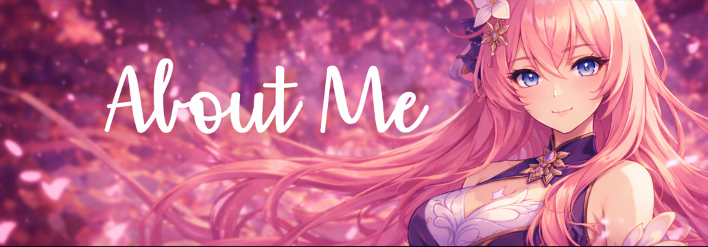
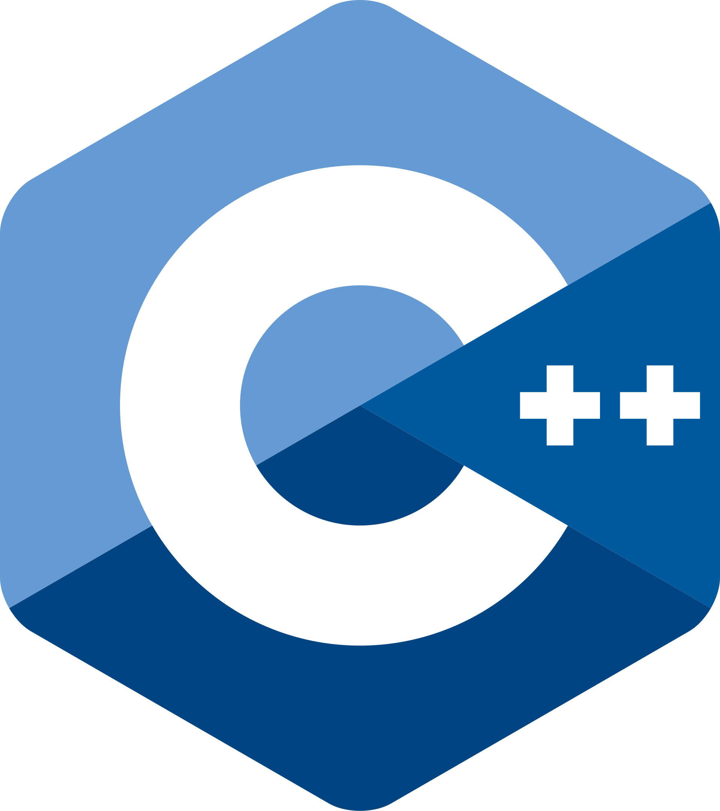
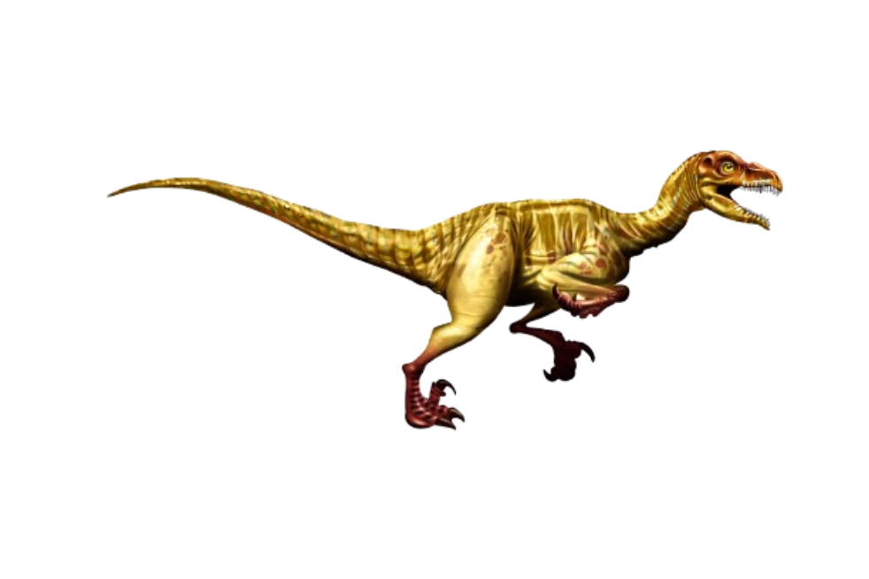

- 
 🇹🇭 Stuedent From Thailand 

- 
 ≧◡≦ But my hobbies are mainly Playing Rivals and Honkai: Star Rail 

- 
I am mainly skilled  Typescript,  C++,  Java,  go

- 
I understand and read very well  Cobole, GODOT, Factor

