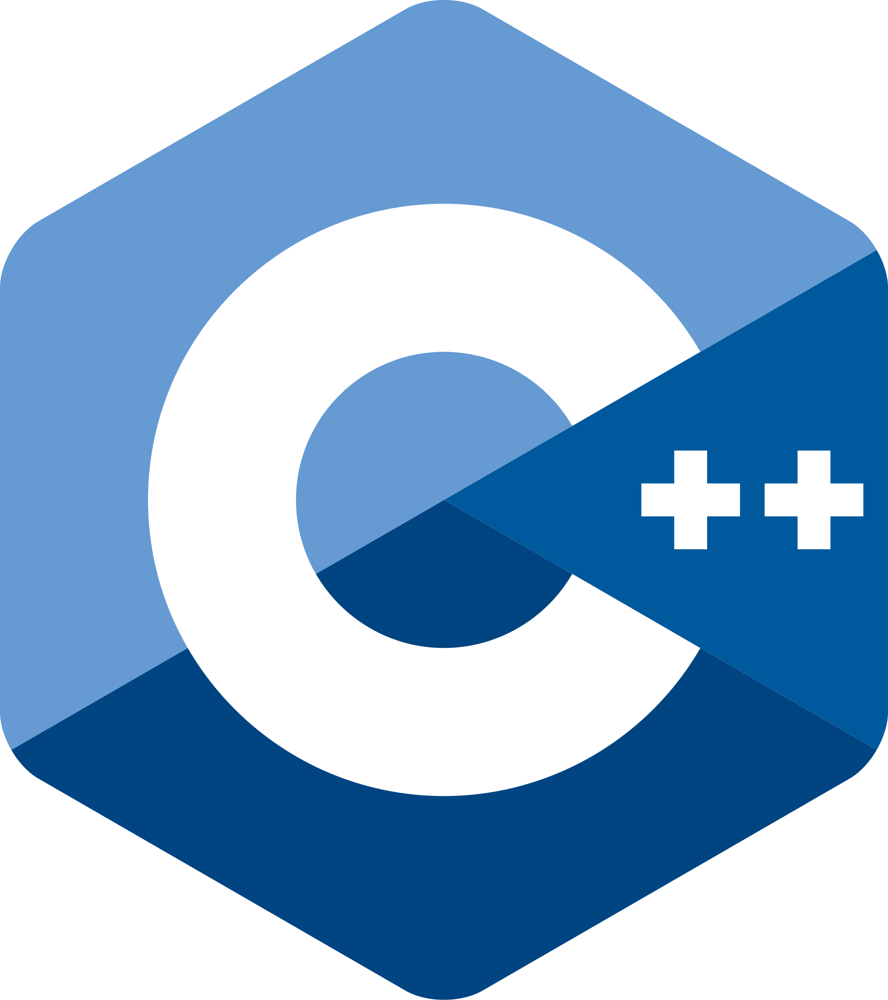

- 🇹🇭 Stuedent From Thailand

- ≧◡≦ But my hobbies are mainly Playing Rivals and Honkai: Star Rail 

- **I am mainly skilled**  Typescript,  C++,  Java,  go

- **I understand and read very well**  Cobole, GODOT, Factor

- **I am currently learning**  Swift,  Julia and  Flask

- 📖 [***kirobotdev/fsk-lang***](https://github.com/kirobotdev/fsk-lang)  
  FSK is a programming language that is compiled to WebAssembly.
- 🤖 [***kirobotdev/Ai-Algorithme***](https://github.com/KirobotDev/Ai-Algorithme)  
  Learn the gpt algorithm & exploited

 ***Readme*** **inspired by aiko-chan-ai** <a href="https://github.com/aiko-chan-ai">aiko-chan-ai</a> 

# Discord

# Star History

## Commits

